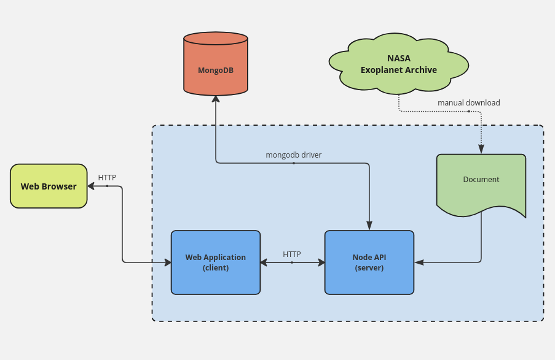

<h1 align="center">NASA Project</h1>

<h2>Description</h2>
Training project from node js video course. Allows you to get to know how to write backend app. Technologies: React, Express, MongoDB, OAuth, Docker.

<h2>Architecture</h2>

<!-- <h2>Setup</h2> -->

<h2>Scripts</h2>
  "install-server": "npm install --prefix server" ---
  "install-client": "npm install --prefix client",
  "install": "npm run install-server && npm run install-client",
  "build-client": "npm run build --prefix client",
  "server": "npm run watch --prefix server",
  "client": "npm start --prefix client",
  "watch": "npm run server & npm run client",
  "deploy": "npm run build --prefix client && npm run cluster --prefix server",
  "test": "npm run test --prefix server && npm run test --prefix client"

<h2>TODO:</h2>
- Add OAuth authorization;